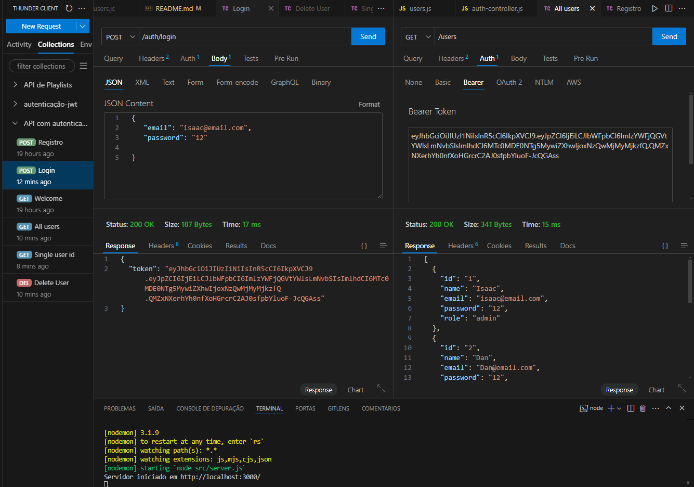

# API-with-protected-routes

## Description
This is a practical project for backend studies, focused on creating an API with protected routes. The goal is to learn and apply authentication and authorization concepts in a Node.js application using Express.

## Online Link
API-with-protected-routes on GitHub

## Project Images


## Features
- 🔒 **User Authentication**: User registration and login with JWT token generation.
- 🛡️ **Protected Routes**: Access to restricted routes only for authenticated users.
- 👥 **User Management**: CRUD for users with different permission levels (admin and standard).
- 📧 **Field Validation**: Verification of required fields and data formats.

## Technologies Used
- Node.js
- Express
- JSON Web Token (JWT)

## How to Run the Project
Follow the steps below to clone, install dependencies, and run the project locally:

1. Clone the repository:
   ```bash
   git clone https://github.com/mdanieldantas/API-with-protected-routes.git
   ```
2. Navigate to the project directory:
   ```bash
   cd API-with-protected-routes
   ```
3. Install dependencies:
   ```bash
   npm install
   ```
4. Run the project:
   ```bash
   npm run dev
   ```
   The server will start at `http://localhost:3000`.

## Project Structure
The folder and file structure of the project is organized as follows:

```
API-with-protected-routes/
├── src/
│   ├── config/
│   │   └── environment.js
│   ├── controllers/
│   │   ├── auth-controller.js
│   │   ├── users-controller.js
│   │   └── welcome-controller.js
│   ├── middlewares/
│   │   └── auth-middleware.js
│   ├── models/
│   │   └── users.js
│   ├── routes/
│   │   └── routes.js
│   └── server.js
└── package.json
```

## Learnings
During the development of this project, the following knowledge was acquired:
- Implementation of authentication and authorization with JWT.
- Creation of middlewares for route protection.
- Structuring Node.js projects with Express.
- Best practices in backend development.

## Contributions
Contributions are welcome! Follow the steps below to contribute:

1. Fork the project.
2. Create a new branch:
   ```bash
   git checkout -b my-new-feature
   ```
3. Make your changes and commit:
   ```bash
   git commit -m 'Add new feature'
   ```
4. Push to the remote repository:
   ```bash
   git push origin my-new-feature
   ```
5. Open a Pull Request.

## License
This project is licensed under the MIT License. See the LICENSE file for more details.

## Contact

**M Daniel Dantas**

- **GitHub:** [mdanieldantas](https://github.com/mdanieldantas)
- **LinkedIn:** [mdanieldantas](https://www.linkedin.com/in/mdanieldantas)
- **Portfolio:** [Daniel Dantas Portfolio](https://danieldantasdev.vercel.app)
- **Email:** [contatomarcosdgomes@gmail.com](mailto:contatomarcosdgomes@gmail.com)
- **Resume:** [Download Resume](https://docs.google.com/document/d/1_FpPYPXiifH1B3BDWnJuNk05DQfddCOBqFxyT6Citg4/edit?usp=sharing)

